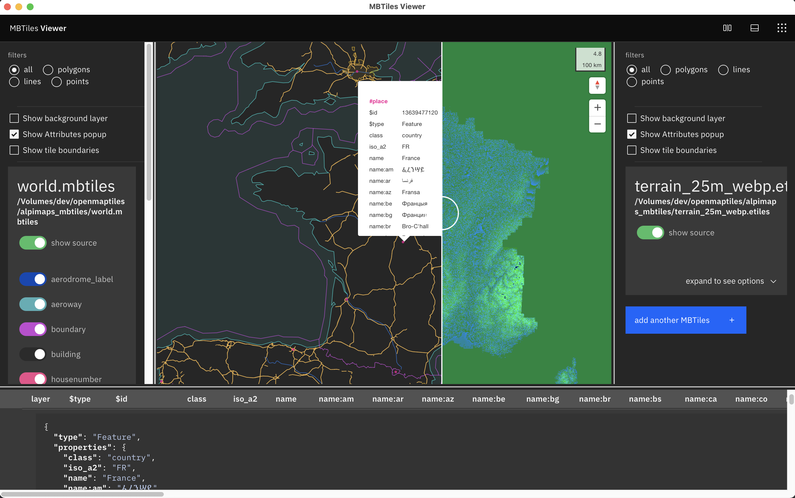

<div align="center">

</div>

<p align="center"><span><b>MBTiles Viewer</b>, a cross-platform MBTiles Viewer.</span></p>
<h4 align="center"><span><a href="https://github.com/Akylas/mbview-rs/releases">Download</a></span> • <span><a href="https://github.com/Akylas/mbview-rs/discussions">Discussions</a></span></h4>

<div align="center">


[](https://github.com/kimlimjustin/xplorer/releases) [](https://github.com/kimlimjustin/xplorer/releases) [](https://github.com/kimlimjustin/xplorer/releases) [](https://github.com/kimlimjustin/xplorer/releases)

</div>

---

# What is MBTiles Viewer?



<!-- <details>
<summary>
View More Screenshots
</summary>

</details> -->

MBTiles Viewer is a tool to view and inspect `mbtiles` files without the need of running a docker or a web server

-   100% offline
-   load vector mbtiles
    * See all layers
    * hide/show layers
    * filter lines/polygons/points
    * click or shift+move to inspect map elements
    * bottom panel to view features details
-   load raster mbtiles
-   load multiple `mbtiles` on the same map
-   split feature to view/compare `mbtiles` side by side
-   multiple themes
-   localized (fr/en for now)

You can give your suggestions and feedback on our [Discussions](https://github.com/Akylas/mbview-rs/discussions/) page. If you feel comfortable in writing code using Typescript and Rust, we highly encourage you to [contribute to this project](https://xplorer.space/docs/community/Contributing/).

---

## Project Roadmap

Recommend us a feature by [opening an Discussion](https://github.com/Akylas/mbview-rs/discussions) if you'd like to.

---

## Installation

If you want to install on your system, you can download the installer for your operating system [on the release page](https://github.com/Akylas/mbview-rs/releases).

---

## Bug Reporting

If you find any bugs, please report it by submitting an issue on our [issue page](https://github.com/Akylas/mbview-rs/issues) with a detailed explanation. Giving some screenshots would also be very helpful.

## Feature Request

You can also submit a feature request on our [issue page](https://github.com/Akylas/mbview-rs) or [discussions](https://github.com/Akylas/mbview-rs/discussions) and we will try to implement it as soon as possible. If you want to contribute to this project, please [contribute to this project](https://xplorer.space/docs/community/Contributing/).

---


## Development

If you want to run this project in your local system, please follow this guide:

1. Fork this project

2. Clone the project to your local system using this command

3. Follow [this guide](https://tauri.studio/en/docs/getting-started/intro/#setting-up-your-environment) to set up Tauri environment

```sh
$ git clone https://github.com/<your_github_username>/mbview-rs.git
```

4. Change directory to the root directory of this project

```sh
$ cd mbview-rs
```

5. Install all dependencies using [`pnpm`](https://pnpm.io/) or [`yarn`](https://yarnpkg.com/)

```sh
$ pnpm install
```

6. Run the project in development mode. Please note that it might takes some times for Cargo to install dependencies for the first run.

```sh
$ pnpm dev
```

## Contribution Guide

We highly encourage you to contribute to this project (even if you are a beginner). And if you finally want to contribute to this project, please read [our contribution guide](https://github.com/Akylas/mbview-rs/blob/master/CONTRIBUTING.md).

---

## LICENSE

[Apache-2.0](https://github.com/Akylas/mbview-rs/blob/master/LICENSE)
