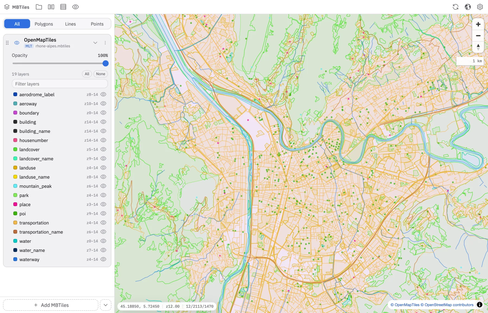
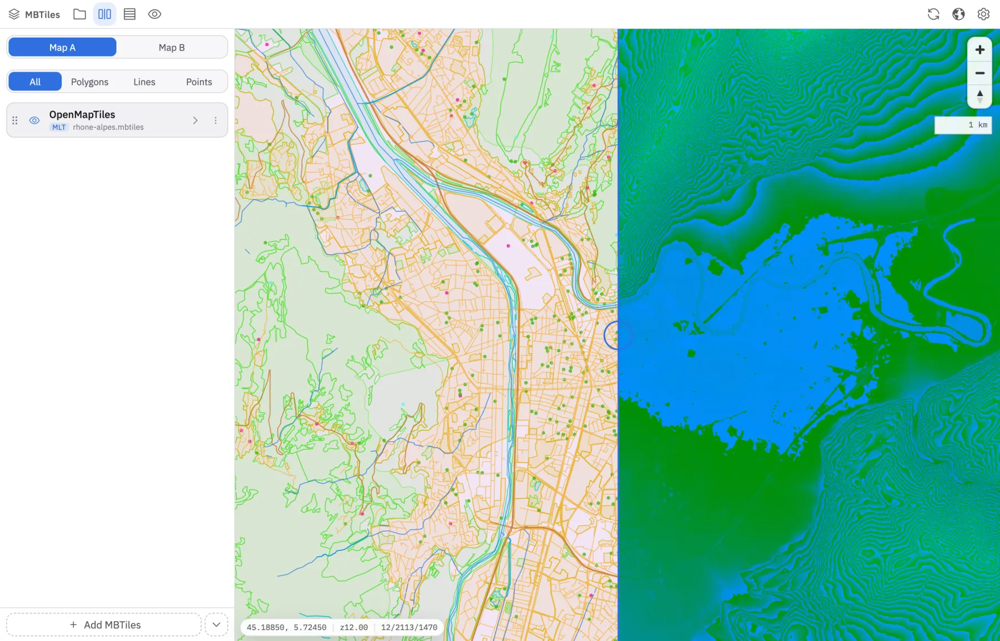
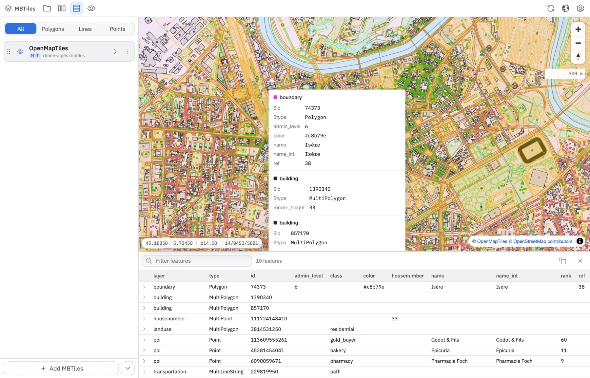
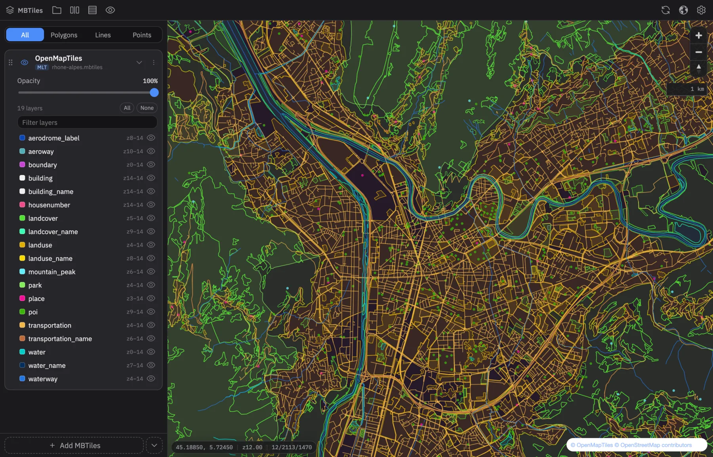
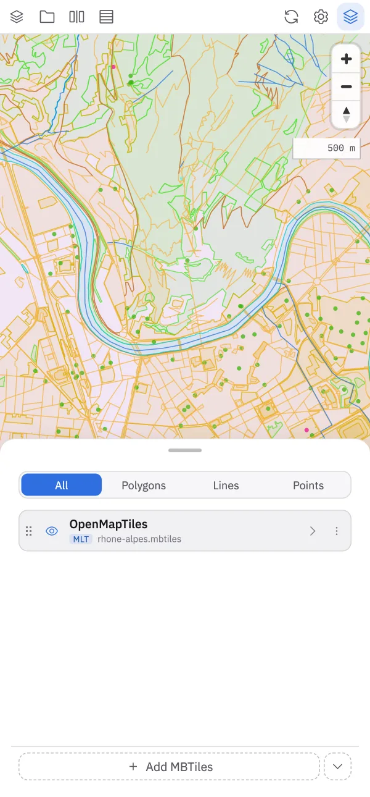

<div align="center">


<h1>MBTiles Viewer</h1>

<p><b>Open an <code>.mbtiles</code> file and look inside it.</b><br />
No docker, no tile server, no upload — a desktop app that reads the file where it sits.</p>

<p>
  <a href="https://akylas.github.io/mbview-rs/"><b>Website</b></a> ·
  <a href="https://github.com/Akylas/mbview-rs/releases"><b>Download</b></a> ·
  <a href="https://github.com/Akylas/mbview-rs/discussions"><b>Discussions</b></a> ·
  <a href="CONTRIBUTING.md"><b>Contributing</b></a>
</p>

<p>
  <a href="https://github.com/Akylas/mbview-rs/releases"></a>
  <a href="LICENSE"></a>
  
</p>



</div>

---

## What it is

MBTiles Viewer is a small cross-platform desktop app for **inspecting and comparing `.mbtiles`
files**. Point it at a file and it draws every layer in its own colour, lists them in a panel you
can toggle and reorder, and lets you click any feature to read its attributes.

It is built for the moment after a tile build finishes and you need to answer *did that actually
work?* — before wiring the tileset into anything.

- **100% offline.** The file never leaves your machine. A tiny Rust HTTP server reads tiles
  straight out of the SQLite file and serves them to the embedded map.
- **Nothing to set up.** No docker image, no `tileserver-gl`, no upload to a viewer site.
- **Reloads itself.** The file is watched: rebuild the tileset and the map redraws.

## Features

|                            |                                                                                                 |
| -------------------------- | ----------------------------------------------------------------------------------------------- |
| **Vector and raster**      | MVT (`pbf`) and [MLT](https://github.com/maplibre/maplibre-tile-spec) vector tiles, plus raster tilesets — optionally drawn as hillshade or terrain-RGB |
| **Every layer, coloured**  | A stable colour per source-layer name, so `water` is blue and `transportation` is orange in every file you open |
| **Layer control**          | Show/hide a whole file or one of its layers, set per-file opacity, filter to points, lines or polygons |
| **Stacking order**         | Drag files to restack them — the panel reads top-to-bottom exactly like the map draws            |
| **Compare**                | Open a second set of files in a split view with a swipe handle, synced camera, and A/B tabs      |
| **Inspect**                | Click (or hover, or hold <kbd>Shift</kbd>) to read a feature's attributes                        |
| **Feature table**          | Sortable, searchable table of what you selected, with the raw JSON per row and copy-as-GeoJSON   |
| **Tile debugging**         | Tile boundaries, collision boxes, live z/x/y readout, and *copy this tile as GeoJSON* from the right-click menu |
| **Picks up where you left**| Remembers the files you had open, the camera, the split position, and which layers you had hidden |
| **Light and dark**         | Follows the system by default                                                                    |
| **Works small**            | Below 840px the panel becomes a bottom sheet, so it is usable in a narrow window                 |

## Screenshots

<table>
  <tr>
    <td width="50%"><br /><sub><b>Compare</b> — two tilesets, one swipe handle</sub></td>
    <td width="50%"><br /><sub><b>Inspect</b> — attributes on click, and a table of everything selected</sub></td>
  </tr>
  <tr>
    <td><br /><sub><b>Dark</b> — follows the system</sub></td>
    <td align="center"><br /><sub><b>Narrow windows</b> — the panel becomes a sheet</sub></td>
  </tr>
</table>

## Install

Grab the installer for your platform from the [releases page](https://github.com/Akylas/mbview-rs/releases).

| Platform    | Bundle                                  |
| ----------- | --------------------------------------- |
| **macOS**   | `.app` — built for Apple Silicon and Intel |
| **Windows** | `.msi`                                  |
| **Linux**   | `.deb`                                  |

Then drop an `.mbtiles` file onto the window, or use <kbd>⌘</kbd>/<kbd>Ctrl</kbd>+<kbd>O</kbd>.

> macOS may say the app is from an unidentified developer on first launch — right-click the app and
> choose *Open*.

## Keyboard shortcuts

| Key                                        | Action                                          |
| ------------------------------------------ | ----------------------------------------------- |
| <kbd>⌘</kbd>/<kbd>Ctrl</kbd> + <kbd>O</kbd> | Open an MBTiles file                            |
| <kbd>L</kbd>                                | Show/hide the layers panel                      |
| <kbd>S</kbd>                                | Split view                                      |
| <kbd>F</kbd>                                | Feature table                                   |
| <kbd>B</kbd>                                | Basemap                                         |
| <kbd>T</kbd>                                | Tile boundaries                                 |
| <kbd>I</kbd>                                | Cycle the attribute popup: click → hover → off  |
| <kbd>Shift</kbd> (held)                     | Inspect features under the pointer              |

## How it works

```
┌──────────────────────────────┐        ┌────────────────────────────────┐
│  Svelte + MapLibre GL        │  HTTP  │  Rust (Tauri)                  │
│  layer panel, compare,       │ ◀────▶ │  hyper server on :9872         │
│  inspection, feature table   │        │  reads tiles from SQLite,      │
│                              │        │  watches the file for changes  │
└──────────────────────────────┘        └────────────────────────────────┘
```

The Rust side opens the `.mbtiles` (SQLite), serves a TileJSON document and the tile blobs over
localhost, and watches the file so a rebuild triggers a redraw. The frontend is a
[MapLibre GL JS](https://maplibre.org/) map: it adds one source per file and, for vector tilesets,
three layers per source-layer (polygons, lines, points) so every geometry type can be toggled on
its own.

Layer visibility is *derived* from three inputs — the file's own flag, the per-layer flag, and the
geometry filter — rather than remembered, which is what keeps the panel and the map from drifting
apart. That logic lives in [`src/lib/sources.ts`](src/lib/sources.ts) and is covered by
`yarn test:ui`.

## Development

Requires [Node.js](https://nodejs.org) (LTS), [yarn](https://yarnpkg.com), and a
[Tauri v2 environment](https://v2.tauri.app/start/prerequisites/) (Rust toolchain plus your
platform's webview dependencies).

```sh
git clone https://github.com/Akylas/mbview-rs.git
cd mbview-rs
yarn install
yarn dev          # runs the app with hot reload
```

| Command           | What it does                                                       |
| ----------------- | ------------------------------------------------------------------ |
| `yarn dev`        | Run the app (Tauri + vite, hot reload)                             |
| `yarn dev:web`    | Frontend only, in a browser — useful for working on the UI chrome  |
| `yarn build`      | Build the installers for the current platform                      |
| `yarn check`      | `cargo check`, eslint and `svelte-check`                           |
| `yarn test`       | Rust tests plus the frontend layer-model tests                     |
| `yarn format`     | prettier and eslint --fix                                          |

### Project layout

```
src/                 Svelte frontend
  components/ui/     design-system primitives (button, toggle, sheet, …)
  components/        app screens: source panel, feature table, popups
  lib/               source model, settings, theme, layout stores
src-tauri/src/       Rust: tile server, mbtiles reader, file watcher
resources/styles/    optional basemap styles
docs/                the project website (GitHub Pages)
```

### Releasing

Releases are cut from the **Release** workflow. Run it from the Actions tab and pick how to bump
the version:

- `auto` — from the conventional-commit history (default)
- `patch` / `minor` / `major` — forced

It bumps `package.json` and `Cargo.toml`, updates `CHANGELOG.md`, tags, and then builds and
uploads a draft release for every platform. Pushing a `v*` tag by hand does the same, minus the
bump.

## Contributing

Issues and pull requests are welcome — including from first-time contributors. Please read the
[contribution guide](CONTRIBUTING.md); commits follow
[conventional commits](https://www.conventionalcommits.org/), which is what drives the changelog.

Found a bug? [Open an issue](https://github.com/Akylas/mbview-rs/issues) with the steps and, if you
can, the tileset that shows it. Ideas and questions belong in
[Discussions](https://github.com/Akylas/mbview-rs/discussions).

## Built with

[Tauri](https://tauri.app) · [Svelte](https://svelte.dev) · [MapLibre GL JS](https://maplibre.org) ·
[hyper](https://hyper.rs) · [rusqlite](https://github.com/rusqlite/rusqlite)

## License

[Apache-2.0](LICENSE) © [Akylas](https://github.com/Akylas)
